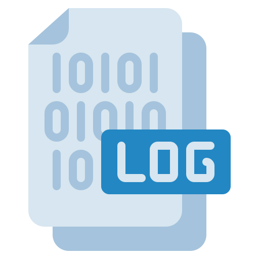
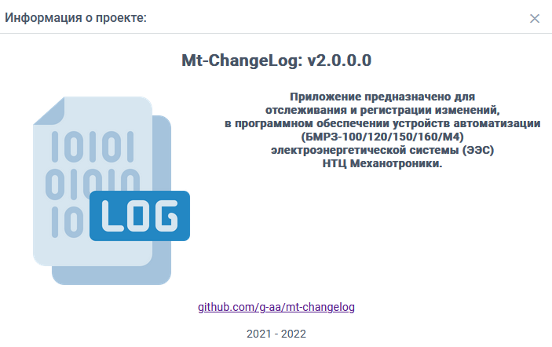
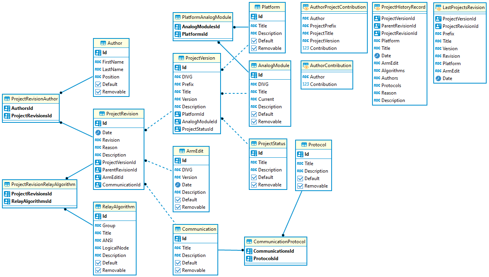
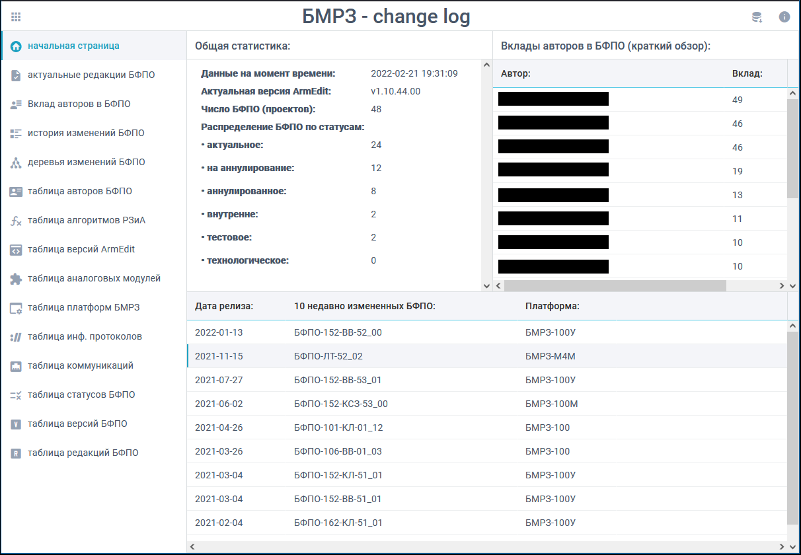
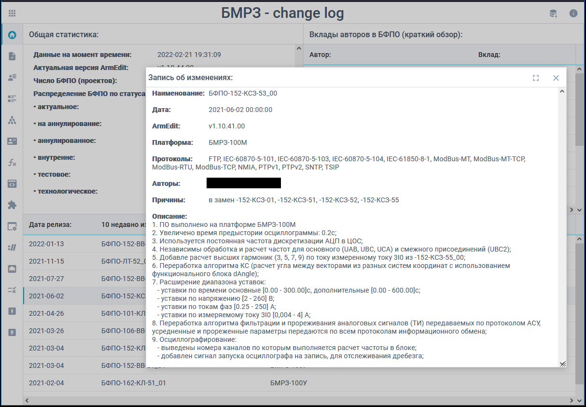
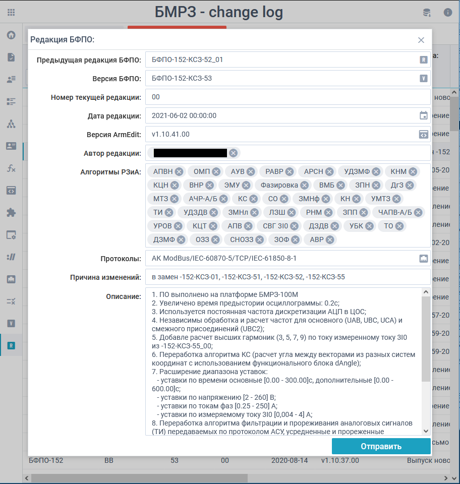
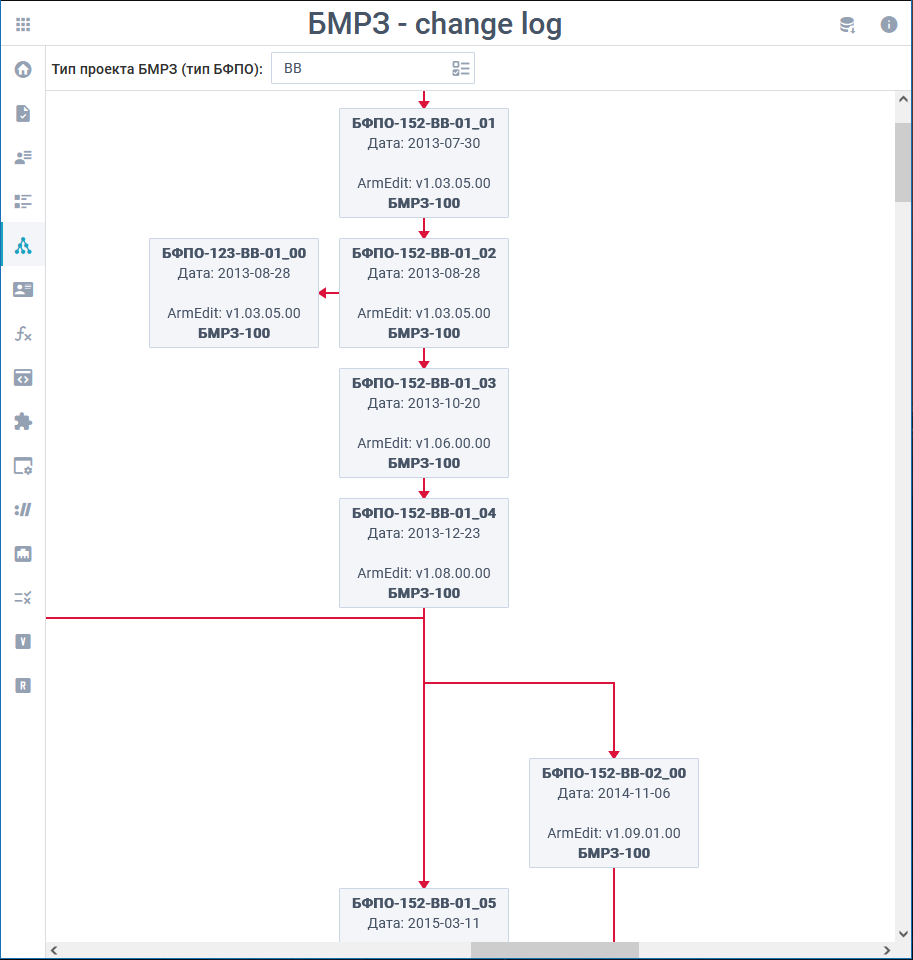
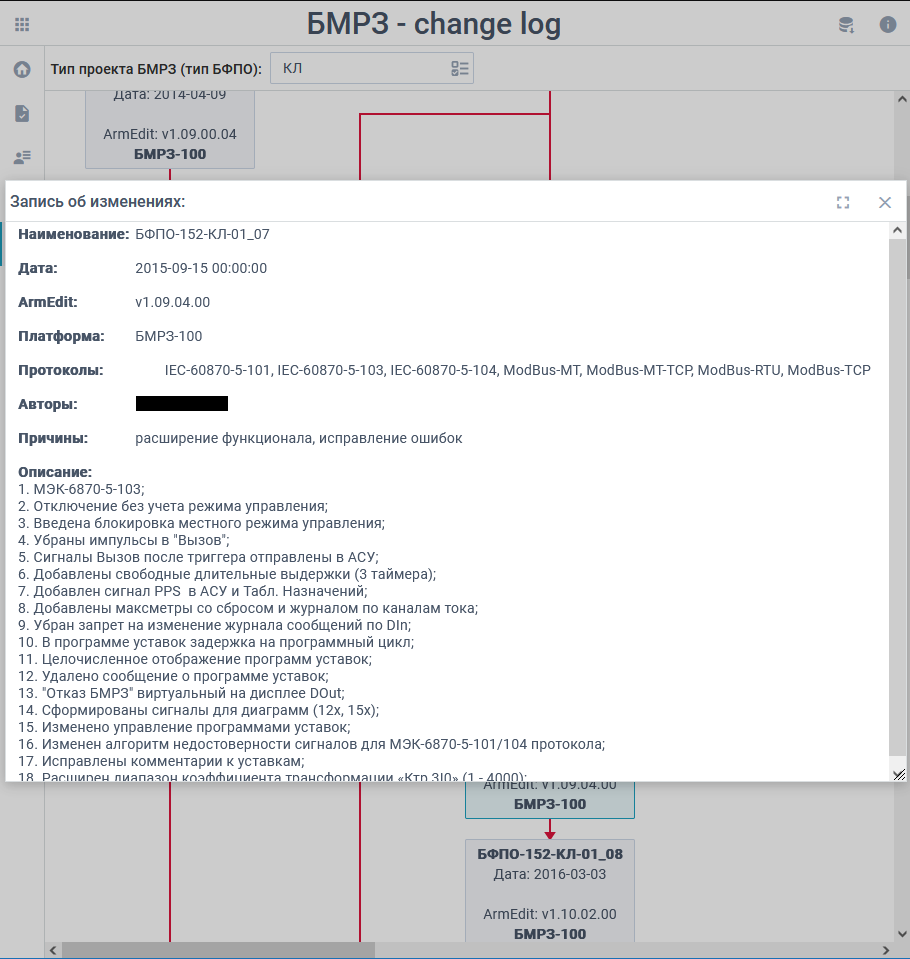
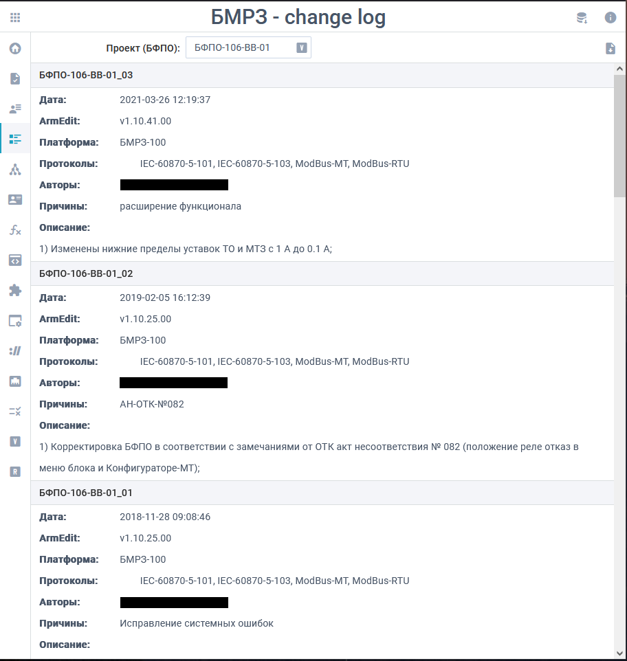
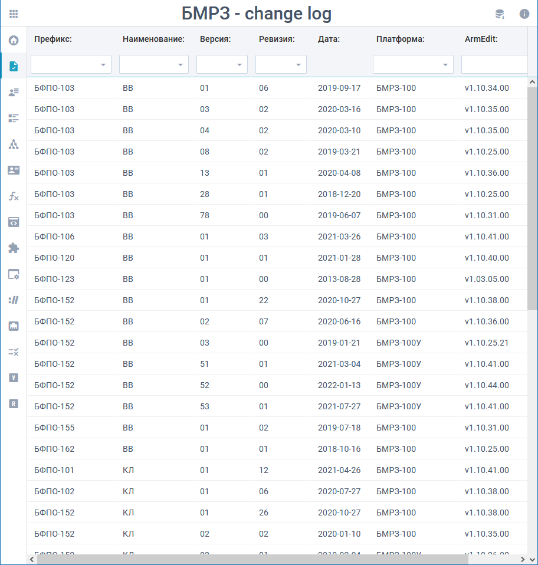

# 
 Mt ChangeLog

Клиент-серверное приложение, предназначенное для отслеживания и регистрации изменений, в 'firmware' устройств автоматизации (БМРЗ-100//120/150/160) электроэнергетической системы (ЭЭС) НТЦ Механотроники.
    

## Перечень технологий (зависимости):

netstandard2.1, net6.0, [Mt.Utilities](https://github.com/g-aa/mt-utilities), [Mt.Entities.Abstractions](https://github.com/g-aa/mt-entities-abstractions),
[Mt.Results](https://github.com/g-aa/mt-results), SonarAnalyzer.CSharp, Npgsql, Npgsql.EFCore, Dapper, NLog, NUnit, Swashbuckle, MediatR, FluentValidation.

## [История изменения.](CHANGELOG.md)

## Состав проекта:

| Компонент                            | Описание                                                                                                                |
|--------------------------------------|-------------------------------------------------------------------------------------------------------------------------|
| Mt.ChangeLog.Entities                | Сущности реляционной модели данных проекта.                                                                             |
| Mt.ChangeLog.Entities.Extensions     | Методы расширения сущностей для преобразования в 'DTO'.                                                                 |
| Mt.ChangeLog.TransferObjects         | Модели объектов 'DTO'.                                                                                                  |
| Mt.ChangeLog.Context                 | Контекст доступа к данным основанный на 'Npgsql.EFCore' для реализации механизма изменяния данных.                      |
| Mt.ChangeLog.DataAccess.Abstractions | Абстракции уровня доступа к данным.                                                                                     |
| Mt.ChangeLog.DataAccess              | Уровень доступа к данным основанный на 'Npgsql', 'Dapper' и хранимых процедурах для реализации механизма чтения данных. |
| Mt.ChangeLog.Logic                   | Уровень логики приложения.                                                                                              |
| Mt.ChangeLog.WebAPI                  | Web-сервис для доступа к данным.                                                                                        |

## Схема базы данных:

Схема базы данных приложения 'Mt ChangeLog' (PostgreSQL).

## Поддерживаемый функционал:

1. **toolbar:**
    - Реализован функционал, позволяющий скачать архив в формате zip истории изменения всех проектов (БФПО) хранящихся на сервере.

2. **начальная страница:**
    - Содержит:
        - общую статистику по проектам в БД;
        - информацию о 10 часто редактируемых проектах;
        - информацию о 10 недавно измененных проектов (БФПО).
        

    - Реализована возможность быстрого просмотра последнего изменения для 10 недавно измененных проектов.
        

2. **таблица авторов БФПО:**
    - Раздел предназначен для просмотра, создания и редактирования перечня алгоритмов РЗиА, содержащихся в проектах;
    - Операция по удалению алгоритма РЗиА на данный момент не предусмотрена;
    - Скриншот в каталоге отсутствует, так-как раздел содержит персональные данные.

3. **таблица алгоритмов РЗиА:**
    - Раздел предназначен для просмотра, создания и редактирования перечня разработчиков проектов;
    - Операция по удалению разработчика проектов на данный момент не предусмотрена.

4. **таблица версий ArmEdit:**
    - Раздел предназначен для просмотра, создания и редактирования перечня версий ArmEdit, используемых в проектах;
    - Операция по удалению версий ArmEdit на данный момент не предусмотрена.

5. **таблица аналоговых модулей:**
    - Раздел предназначен для просмотра, создания и редактирования перечня аналоговых модулей, применяемых в блоках БМРЗ-100/120/150/160;
    - Операция по удалению аналогового модуля на данный момент не предусмотрена.

6. **таблица платформ БМРЗ:**
    - Раздел предназначен для просмотра, создания и редактирования перечня платформ, используемых в блоках БМРЗ-100/120/150/160;
    - Операция по удалению платформы на данный момент не предусмотрена.

7. **таблица протоколов инф. обмена:**
    - Раздел предназначен для просмотра, создания и редактирования перечня протоколов информационного обмена, используемых в блоках БМРЗ-100/120/150/160;
    - Операция по удалению протокола на данный момент не предусмотрена.

8. **таблица коммуникаций:**
    - Раздел предназначен для просмотра, создания и редактирования модуля коммуникаций, поддерживаемых в блоках БМРЗ-100/120/150/160;
    - Операция по удалению протоколов информационного обмена на данный момент не предусмотрена.

9. **таблица статусов БФПО:**
    - Раздел предназначен для просмотра, создания и редактирования статусов проектов, присваиваемых БФПО;
    - Операция по удалению статуса проекта на данный момент не предусмотрена.

10. **таблица версий БФПО:**
    - Раздел предназначен для просмотра, создания и редактирования перечня проектов блоков БМРЗ-100/120/150/160;
    - Операция по удалению версии проекта на данный момент не предусмотрена.
        

11. **таблица редакций БФПО:**
    - Раздел предназначен для просмотра, создания и редактирования перечня редакций проектов блоков БМРЗ-100/120/150/160;
    - Операция по удалению редакции проекта на данный момент не предусмотрена.
        

12. **деревья изменений БФПО:**
    - Раздел предназначен для визуализации хронологического графа (дерева) версий и редакций проектов (БФПО);
        

    - Реализована возможность быстрого просмотра изменения выбранной редакции проекта в дереве.
        

13. **история изменений БФПО:**
    - Раздел предназначен для просмотра полной истории изменения выбранной версии проекта (БФПО) от самой последней редакции до самой первой;
    - Реализован функционал, позволяющий скачать историю изменения выбранного проекта в формате txt;
    - При выводе и визуализации истории изменений также выводятся версии и редакции проектов (в хронологическом порядке), на основании которых разработана рассматриваемая версия проекта.
        

14. **таблица актуальных редакций БФПО:**
    - Раздел предназначен для просмотра номеров актуальных редакций всех проектов (БФПО) используемых в блоках БМРЗ-100/120/150/160.
        

